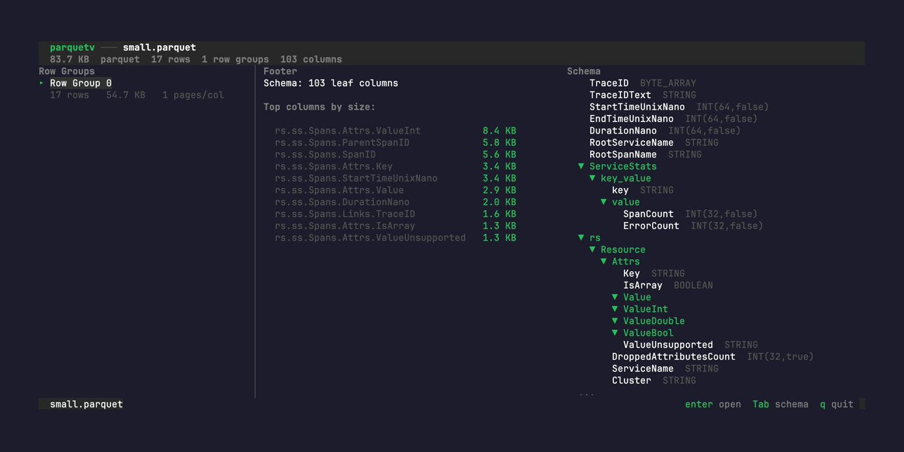
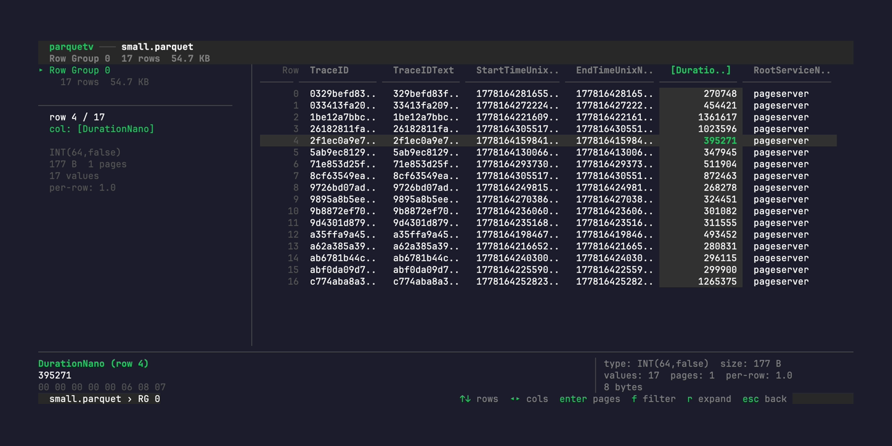
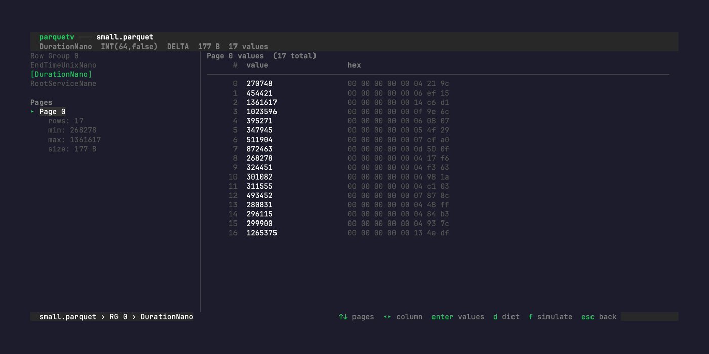
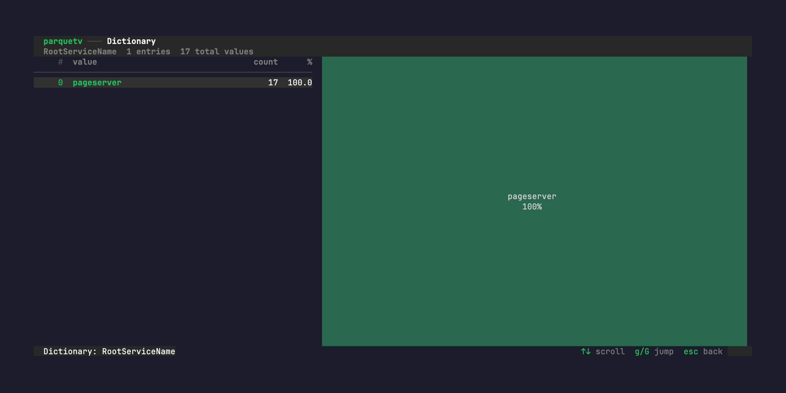

# parquetv

Interactive terminal explorer for Parquet files. See both the logical data (rows) and the physical storage (columns, pages, encodings) linked together.

Built for understanding how columnar storage actually works — not just reading the data, but seeing *why* dictionary encoding saves space, *where* page boundaries fall, and *what* predicate pushdown actually skips.

## Screenshots

### File overview

Row groups, top columns by size, schema tree, and key-value metadata at a glance.



### Row group grid

Rows × columns with virtual scrolling. The left panel shows column stats (type, encoding, size, per-row ratio) for the selected column. The bottom inspector shows the full decoded value and hex dump for the cell under the cursor.



### Page inspector

Drill into any column to see its pages — min/max stats, size, encoding. Values shown with decoded representation alongside raw hex bytes.



### Dictionary viewer

Press `d` on a dict-encoded column to see all unique values sorted by frequency with distribution bars.



## Features

**Three-level drill-down** following the physical Parquet structure:

| Level | View | What you see |
|-------|------|-------------|
| **File overview** | Row groups + footer | Row group sizes, top columns by size, schema tree, KV metadata |
| **Row group grid** | Rows × columns | Virtual-scrolled data grid, column stats, page boundaries, cell inspector |
| **Page inspector** | Pages + values | Page min/max, encoding, compression, hex viewer, dictionary entries |

**Column statistics** — select any column to see type, encoding, compressed size, value count, pages, and the per-row ratio (1.0 for trace-level, ~20 for span-level, ~275 for attributes).

**Page boundaries** — dashed lines in the grid show where page breaks fall. Different columns have different boundaries.

**Cell inspector** — always-visible panel showing the full decoded value, hex dump, and byte count for the cell under the cursor. Repeated/nested values expand inline.

**Dictionary viewer** — press `d` on a dict-encoded column to see all unique values sorted by frequency, with counts and visual distribution bars.

**Virtual scrolling** — handles files with hundreds of thousands of rows. Only decodes the pages visible in the viewport. Seeks to any row in ~13ms.

## Install

```bash
go install github.com/javiermolinar/parquetv@latest
```

Or build from source:

```bash
git clone https://github.com/javiermolinar/parquetv.git
cd parquetv
go build -o parquetv .
```

Requires Go 1.25+.

## Usage

```bash
parquetv <file.parquet>
```

Opens the file and shows the file overview. Press `enter` to drill into a row group, then `enter` again on a column to inspect its pages.

## Keybindings

### Global

| Key | Action |
|-----|--------|
| `enter` | Drill into selected item |
| `esc` | Back to previous level |
| `q` | Quit |
| `j` / `k` or `↑` / `↓` | Move cursor |
| `g` / `G` | Jump to first / last |
| `ctrl+d` / `ctrl+u` | Half-page down / up |

### File overview (Level 1)

| Key | Action |
|-----|--------|
| `enter` | Open selected row group |
| `Tab` | Toggle schema tree panel |

### Row group grid (Level 2)

| Key | Action |
|-----|--------|
| `h` / `l` or `←` / `→` | Select column |
| `enter` | Inspect selected column's pages |
| `f` | Filter on selected column |
| `r` | Expand nested values inline |
| `esc` | Back to file overview |

### Page inspector (Level 3)

| Key | Action |
|-----|--------|
| `enter` | Show values for selected page |
| `←` / `→` | Switch to adjacent column |
| `d` | Dictionary viewer |
| `f` | Simulate predicate pushdown |
| `esc` | Back (values → pages → grid) |

## Architecture

```
view/    → Pure rendering functions. Takes ViewModels, returns strings. All lipgloss here.
model/   → BubbleTea models. State, Update(), builds ViewModels.
ui/      → ViewModel structs. The contract between model and view.
engine/  → Parquet reading. No TUI imports. Testable without a terminal.
```

Import graph: `model → ui ← view`, `model → engine`, `engine → nothing`.

Views are pure functions — same input always produces same output. Golden file tests call the view directly with test ViewModels.

## Development

```bash
make test            # run all tests
make dev             # file-watching test loop (requires entr)
make run             # open testdata/small.parquet
make live            # file-watching run loop

# regenerate golden files after UI changes
go test ./view/ -update
```

Golden files in `testdata/` serve as tests, documentation, and regression guards. Reviewers see exactly what the UI looks like as text diffs.

## Dependencies

- [parquet-go](https://github.com/parquet-go/parquet-go) — low-level Parquet reading (same library Grafana Tempo uses)
- [bubbletea](https://github.com/charmbracelet/bubbletea) — terminal UI framework
- [lipgloss](https://github.com/charmbracelet/lipgloss) — terminal styling and layout

## License

MIT
